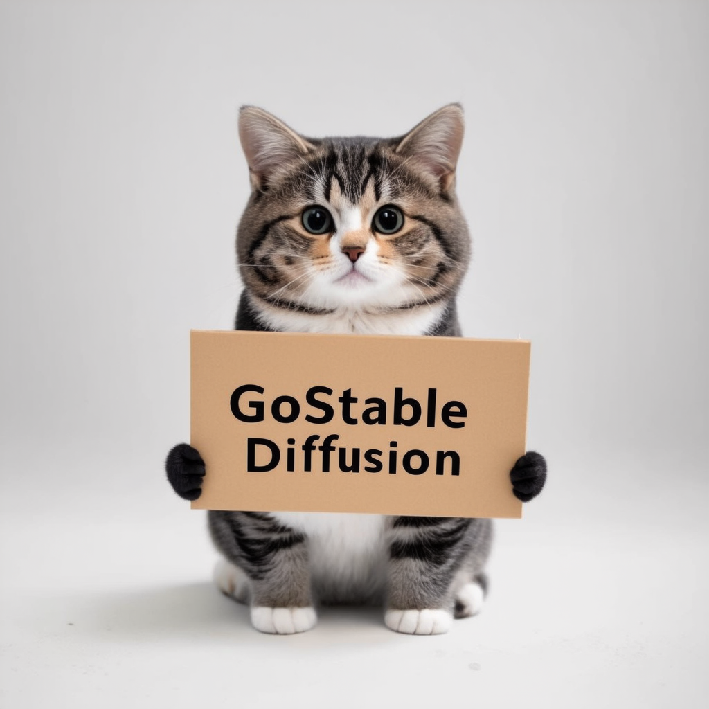

<p align="center">
  
</p>

# GoStableDiffusion

CGO bindings for the awesome [stable-diffusion.cpp](https://github.com/leejet/stable-diffusion.cpp) project

## Supported features
- [x] TXT2IMG
- [ ] IMG2IMG
- [ ] IMG2VID (Waiting for `stable-diffusion.cpp` [implementation](https://github.com/leejet/stable-diffusion.cpp/blob/10c6501bd05a697e014f1bee3a84e5664290c489/examples/cli/main.cpp#L821))
- [ ] Image upscaling
- [ ] [Model quantization and conversion](https://github.com/leejet/stable-diffusion.cpp/blob/master/docs/quantization_and_gguf.md)
- [ ] [PhotoMaker](https://github.com/leejet/stable-diffusion.cpp/blob/master/docs/photo_maker.md)

## ⚙️ Setup
### `stable-diffusion.cpp`

For this library to work you will need the compiled `stable-diffusion.cpp` library.
Currently, [master-f7f05fb](https://github.com/leejet/stable-diffusion.cpp/releases/tag/master-f7f05fb) is supported.

You can either compile it yourself using the [official manual](https://github.com/leejet/stable-diffusion.cpp?tab=readme-ov-file#build)
or you use the prebuilt library from the official [Releases](https://github.com/leejet/stable-diffusion.cpp/releases/tag/master-f7f05fb).

### Installation

Now you have to install the shared library to your system. Either you place it at the same folder as your executable, or you install it system-wide:

> [!NOTE]
> Keep in mind you need to ship the shared library with your application.

#### Installing - Linux
On Linux you can copy `libstable-diffusion.so` to `/usr/local/lib/`.

#### Installing - macOS
On macOS you can copy `libstable-diffusion.dylib` to `/usr/local/lib/`.

#### Installing - Windows
On Windows you can keep `libstable-diffusion.dll` in the same directory as your executable.

## 🎨 Usage

Get the package
```shell
$ go get -u github.com/binozo/gostablediffusion
```

Now you are ready to go! 🚀

> [!NOTE]
> Remember that this package uses CGO. You will need to specify `CGO_ENABLED=1` otherwise this library won't compile.
> E.g. `CGO_ENABLED=1 go run main.go`

## Example

[main.go](./cmd/main/main.go)
```go
package main

import (
	"fmt"
	"image/png"
	"os"
	"time"
	"unsafe"

	"github.com/binozo/gostablediffusion/pkg/sd"
)

func main() {
	fmt.Println("Warming up")

	sd.SetLogCallback(func(level sd.LogLevel, text string, data unsafe.Pointer) {
		switch level {
		case sd.LogDebug:
			fmt.Print("DEBUG:", text)
		case sd.LogInfo:
			fmt.Print("INFO:", text)
		case sd.LogWarn:
			fmt.Print("WARN:", text)
		case sd.LogError:
			fmt.Print("ERROR:", text)
		default:
			fmt.Print("???:", text)
		}
	})

	sd.SetProgressCallback(func(step, steps int, time time.Duration, data unsafe.Pointer) {
		fmt.Printf("PROGRESS: Completed step %d of %d in %0.2fs\n", step, steps, time.Seconds())
	})

	ctx, err := sd.New().
		SetModel("models/sd-v1-4.ckpt").
		Load()

	if err != nil {
		panic(err)
	}
	defer ctx.Free()

	params := sd.NewImageGenerationParams()
	params.Guidance.TxtCfg = 3
	params.SampleSteps = 30
	params.SampleMethod = sd.Euler
	params.Height = 768
	params.Width = 768
	params.Seed = 42
	params.Prompt = "fantasy medieval village world inside a glass sphere , high detail, fantasy, realistic, light effect, hyper detail, volumetric lighting, cinematic, macro, depth of field, blur, red light and clouds from the back, highly detailed epic cinematic concept art cg render made in maya, blender and photoshop, octane render, excellent composition, dynamic dramatic cinematic lighting, aesthetic, very inspirational, world inside a glass sphere by james gurney by artgerm with james jean, joe fenton and tristan eaton by ross tran, fine details, 4k resolution"

	fmt.Println("Running inference")
	result := ctx.GenerateImage(params)
	defer result.Free()

	fmt.Println("Writing result to output.png")
	targetFile, _ := os.OpenFile("output.png", os.O_WRONLY|os.O_CREATE, 0600)
	defer targetFile.Close()
	if err = png.Encode(targetFile, result.Image()); err != nil {
		panic(err)
	}
	fmt.Println("Done")
}

```

## 🧑‍💻 Development

First clone this project:

```shell
$ git clone https://github.com/Binozo/GoStableDiffusion
$ cd GoStableDiffusion
```

and compile the `stable-diffusion.cpp` shared library:
```shell
$ go generate
```

> [!NOTE]
> `go generate` executes the [build.sh](./build.sh) script on unix or [build.bat](./build.bat) on windows.

The `go:generate` script currently supports cuda, vulkan and metal as hardware accelerators.

To enable one of these, simply set one of the following:
- `CUDA=1`
- `VULKAN=1`
- `METAL=1`

before running `go generate`. Example:

```shell
...
$ CUDA=1 go generate
```

> [!TIP]
> If you need extra help you can look at the [Dockerfile](./Dockerfile), [Dockerfile.cuda](./Dockerfile.cuda) or [Dockerfile.vulkan](./Dockerfile.vulkan) files.
> Or just create an issue.

After successful compilation you will find your built shared library at `stable-diffusion.cpp/build/bin/libstable-diffusion<.so/.dylib/.dll>`.
